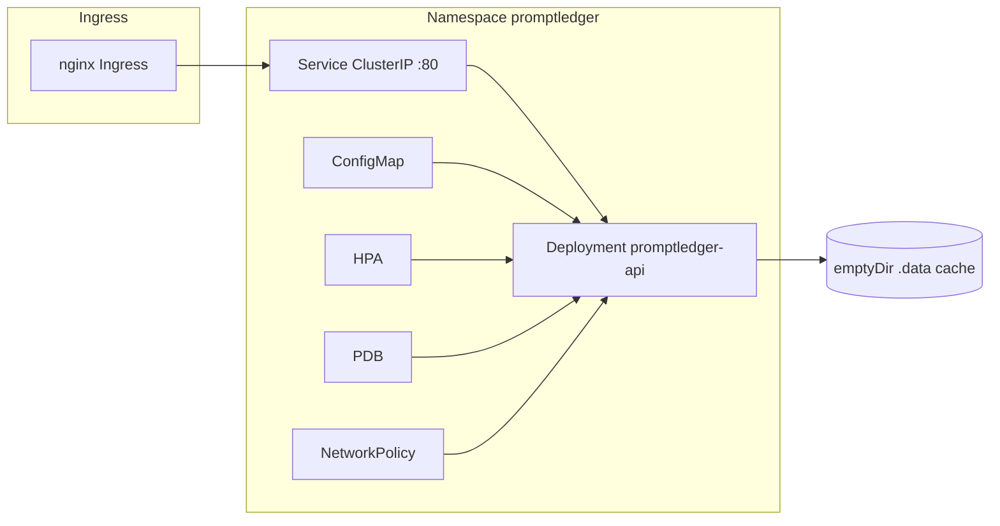

# PromptLedger on Kubernetes

Production-style manifests for the multi-vertical demo API (Legal · Fintech · Healthcare · Enterprise AI).

**Architecture diagram:** [PNG](../../docs/architecture/kubernetes-deployment-architecture.png) · [FigJam source](../../docs/architecture/kubernetes-deployment-architecture.jam) · [docs](../../docs/architecture/README.md)

## Architecture



## What this demonstrates

| Practice | Where |
|----------|--------|
| Multi-stage container build | `deploy/docker/Dockerfile` (Go GraphRAG + Python API) |
| Kustomize base + overlays | `base/`, `overlays/dev`, `staging`, `production` |
| Probes (startup / liveness / readiness) | `base/deployment.yaml` |
| Security context (non-root, read-only root FS) | `base/deployment.yaml` |
| Resource requests & limits | overlays per environment |
| HPA (CPU + memory in prod) | `base/hpa.yaml`, `production/hpa-patch.yaml` |
| PodDisruptionBudget | `base/pdb.yaml` |
| NetworkPolicy | `base/networkpolicy.yaml` (disabled in dev) |
| Topology spread + anti-affinity | `base/deployment.yaml` |
| Ingress + TLS annotations | staging / production overlays |

## Quick start (kind)

```bash
chmod +x scripts/k8s-*.sh
./scripts/k8s-kind-up.sh
```

Then open **http://127.0.0.1:8765** (mapped to NodePort 30765).

Or port-forward:

```bash
kubectl -n promptledger port-forward svc/promptledger-api 8765:80
```

## Manual deploy

```bash
# Build image
./scripts/k8s-build.sh

# Dev (1 replica, NodePort, no HPA)
kubectl apply -k deploy/kubernetes/overlays/dev

# Staging / production
kubectl apply -k deploy/kubernetes/overlays/staging
kubectl apply -k deploy/kubernetes/overlays/production
```

Preview rendered manifests:

```bash
kubectl kustomize deploy/kubernetes/overlays/production
```

## Container details

- **Image**: `promptledger/demo:latest` (override with `IMAGE=` env var)
- **Port**: 8765 in-container; Service exposes port 80 → 8765
- **Writable cache**: `emptyDir` mounted at `/app/.data` (GraphRAG index cache)
- **GraphRAG**: pre-built binary at `/app/bin/graphrag` (`GRAPHRAG_BIN`)
- **Health**: `GET /api/health`

## Demo talking points

1. **Same governance repo** runs locally, in CI, and in Kubernetes — prompts, packs, and scenarios ship inside the image.
2. **Rolling updates** with `maxUnavailable: 0` keep the demo UI up during deploys.
3. **HPA + PDB** show how you scale the control plane without breaking voluntary disruptions.
4. **Overlays** map to your usual `dev → staging → prod` promotion story (mirrors PromptLedger’s own manifest pins).

## Cleanup

```bash
kubectl delete -k deploy/kubernetes/overlays/dev
kind delete cluster --name promptledger
```
