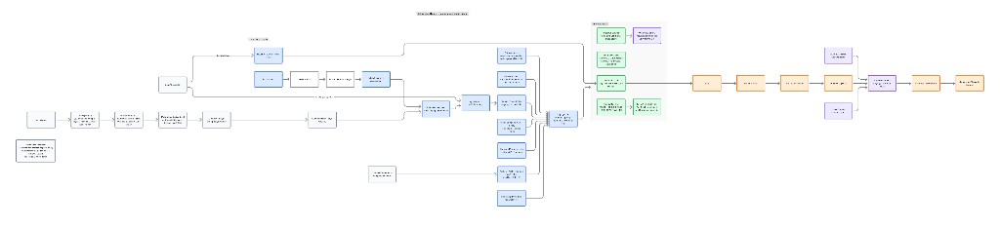

# Architecture diagrams

## Kubernetes deployment

### Files

| File | Use |
|------|-----|
| [kubernetes-deployment-architecture.png](./kubernetes-deployment-architecture.png) | README / docs / presentations (renders on GitHub) |
| [kubernetes-deployment-architecture.jam](./kubernetes-deployment-architecture.jam) | Editable source — open in [Figma FigJam](https://www.figma.com/figjam/) |

### What the diagram shows

**Ingress & API**

- API Gateway (Ingress) → Auth (OIDC/RBAC) → request validation
- PromptLedger Core API (Go/Python)

**Kubernetes cluster (EKS / GKE / AKS / kind)**

- Prompt versioning & registry, automated tests, CI/CD (GitHub Actions / ArgoCD), auto-promotion
- **GraphRAG Engine (Go)** — knowledge graph, local-to-global search, context augmentation
- **Governance & audit** — lineage, OPA policy, Legal/Fintech/Healthcare compliance
- Service mesh, Prometheus/Grafana, logging, Vault

**Storage**

- Vector DB, graph DB, PostgreSQL, object storage (S3)

**Execution**

- LLM orchestrator → providers → post-processing & guardrails → response → user feedback loop

**Repo implementation:** [deploy/kubernetes/README.md](../../deploy/kubernetes/README.md) (Kustomize, Dockerfile, kind scripts).
