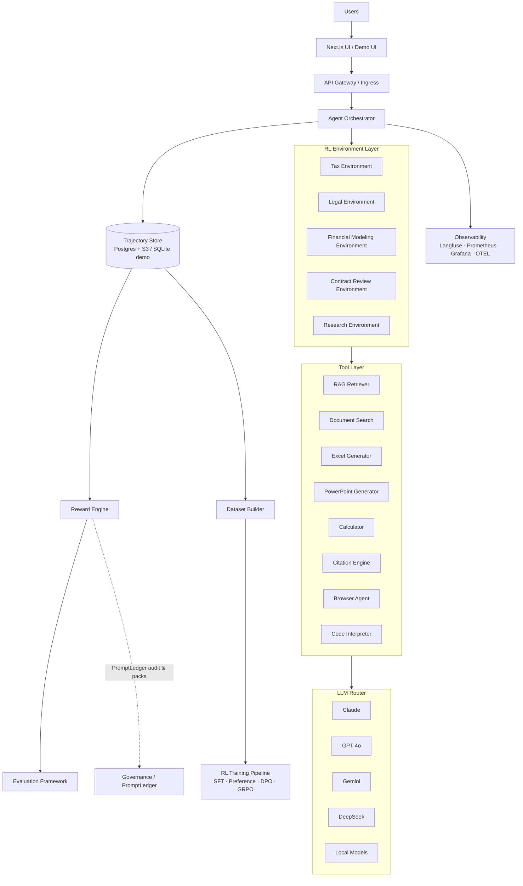

# PromptLedger Agent + RL Platform Architecture

End-to-end stack for multi-environment agents, trajectory logging, reward shaping, and RL dataset export — integrated with PromptLedger governance.

## System diagram



## Layer mapping (this repo)

| Layer | Implementation |
|-------|----------------|
| **UI** | `web/frontend/` (demo); **Next.js** target in `platform/frontend/README.md` |
| **API Gateway** | Kubernetes Ingress / nginx — [deploy/kubernetes](../../deploy/kubernetes/README.md) |
| **Agent Orchestrator** | `src/prompt_ledger/platform/orchestrator.py` |
| **RL Environments** | `platform/config/environments.yaml` |
| **Tools** | `src/prompt_ledger/platform/tools.py` |
| **LLM Router** | `src/prompt_ledger/platform/router.py` |
| **Trajectory Store** | `trajectory_store.py` (SQLite); Postgres via `DATABASE_URL` (roadmap) |
| **Reward Engine** | `reward.py` — uses audit + pack verify + tool signals |
| **Evaluation** | `evaluation.py` |
| **Observability** | `observability.py` + `platform/config/observability.yaml` |
| **Dataset Builder** | `dataset.py` → `.data/datasets/*.jsonl` |
| **PromptLedger CI/CD** | `prompt-ledger audit|test|promote` — gates before production agents |

## Trajectory schema

Each run records:

- **Prompt** — rendered system + user from manifest pin
- **State** — environment, task
- **Action** — tool invocation name
- **Tool calls** — input / output / latency
- **Observation** — tool result
- **Output** — step and final completion
- **Reward** — correctness, citation, cost, latency, policy, human feedback

## Quick start

```bash
prompt-ledger agent list-envs
prompt-ledger agent run --env legal --task "Review late payment clause"
prompt-ledger agent trajectories
prompt-ledger agent evaluate
prompt-ledger agent datasets
```

API (with demo server running):

```bash
curl -X POST http://127.0.0.1:8765/api/agent/run \
  -H 'Content-Type: application/json' \
  -d '{"environment":"contract_review","task":"Review indemnity cap"}'
```

## RL training pipeline (export)

| Dataset | File | Use |
|---------|------|-----|
| SFT | `sft.jsonl` | Supervised fine-tuning on high-reward trajectories |
| Preference | `preference.jsonl` | chosen vs rejected pairs |
| DPO | `dpo.jsonl` | Direct preference optimization |
| GRPO | `grpo.jsonl` | Group-relative policy optimization |

Generated under `.data/datasets/` via `prompt-ledger agent datasets`.
