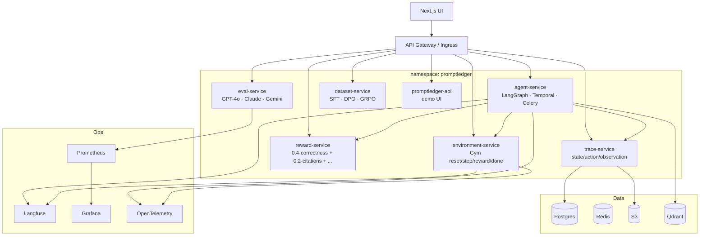

# Platform microservices on Kubernetes

Extends the PromptLedger control plane with six RL/agent services, Halluminate-style long-horizon tasks, and production infrastructure targets.

## Service topology



## Microservices

### agent-service (8081)

- **LangGraph** supervisor graph (`platform/config/multi_agent.yaml`)
- **Temporal** / **Celery** workflow stubs (metadata on responses)
- `POST /api/v1/agent/run` — single-agent run
- `POST /api/v1/agent/supervisor` — multi-agent (Retrieval, Tax, Legal, Citation, Excel, PPT, Verification)
- `POST /api/v1/agent/long-horizon/{task_id}` — 20–50 step workflows (SEC → Excel → EBITDA → memo → PPT)

### environment-service (8082)

OpenAI Gym-compatible API:

| Endpoint | Gym |
|----------|-----|
| `POST /api/v1/env/reset` | `reset()` |
| `POST /api/v1/env/step` | `step()` |
| `GET /api/v1/env/{id}/reward` | `reward()` |
| `GET /api/v1/env/{id}/done` | `done()` |

Environments: **Tax**, **Legal**, **Financial Modeling**, **Contract Review**, **Research**.

### reward-service (8083)

```
reward = 0.4·correctness + 0.2·citations + 0.15·latency + 0.15·cost + 0.1·compliance
```

Config: `platform/config/reward_formula.yaml`

### trace-service (8084)

Stores trajectories:

```
trajectory_id
state_0, action_0, observation_0
state_1, action_1, observation_1
...
```

Demo: SQLite; production: **Postgres + S3** (`DATABASE_URL`, `TRAJECTORY_S3_BUCKET`).

### eval-service (8085)

`POST /api/v1/eval/benchmark` — runs across **GPT-4o**, **Claude**, **Gemini**.

Metrics: success rate, average reward, hallucination %, tool usage %, latency, cost.

### dataset-service (8086)

`POST /api/v1/datasets/build` → `sft.jsonl`, `preference.jsonl`, `dpo.jsonl`, `grpo.jsonl`

## Advanced features (config + stubs)

| Feature | Config |
|---------|--------|
| Long-horizon tasks | `platform/config/long_horizon_tasks.yaml` |
| Computer use RL | Playwright, Browserbase, OpenAI/Claude computer use → QuickBooks, Excel, SAP, NetSuite, Salesforce |
| Multi-agent | `platform/config/multi_agent.yaml` |
| Infrastructure | `platform/config/infrastructure.yaml` |

## Deploy

```bash
# Local processes
./scripts/platform-services.sh

# Docker Compose
docker compose -f deploy/compose/platform-services.yml up --build

# Kubernetes (Kustomize)
./scripts/k8s-platform-build.sh
kubectl apply -k deploy/kubernetes/platform

# Helm
helm upgrade --install promptledger-platform deploy/helm/promptledger-platform -n promptledger
```

## GitOps / IaC

| Tool | Path |
|------|------|
| Helm | `deploy/helm/promptledger-platform/` |
| Kustomize | `deploy/kubernetes/platform/` |
| Terraform (EKS scaffold) | `deploy/terraform/environments/dev/` |
| ArgoCD | Wire Helm chart as Application (see terraform README) |
| CI | GitHub Actions + Docker → ECR |

## Related

- [agent-rl-platform.md](./agent-rl-platform.md)
- [kubernetes deployment](./README.md)
- [services/README.md](../../services/README.md)
